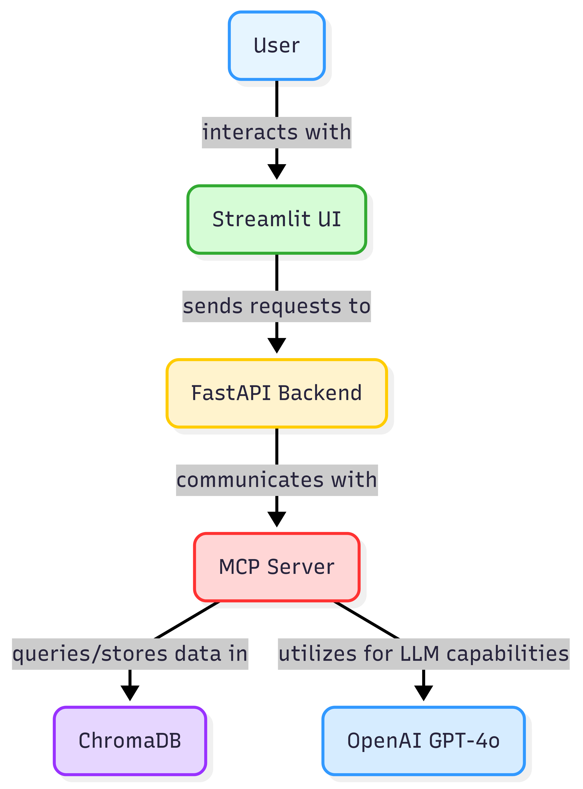

# mcp-agentic-rag

*E2E, production-grade **Agentic RAG** powered by **MCP (Model Context Protocol)**, **ChromaDB**, **OpenAI**, and a clean **Streamlit** UI — all packed into Docker.*

> Upload a PDF/TXT → semantic chunking & embeddings → fast vector search (Chroma) → MCP tools → grounded synthesis with inline citations → pretty answers in the browser.
---

## ✨ Why this project stands out

* **Agentic by design:** Uses **MCP tools** (`document_search`, `web_search`) so your RAG can call capabilities, not just retrieve text — MCP is an open standard often described as the “USB-C of AI apps.” ([Model Context Protocol][1])
* **Grounded answers with inline cites:** Prompts constrain the LLM to **use only provided context** and add `[1]`, `[2]` style citations. ([OpenAI][2])
* **Fast local vector store:** **ChromaDB** with a **PersistentClient** — your embeddings live on disk and survive restarts. ([Chroma Docs][3])
* **Great default embeddings:** **all-MiniLM-L6-v2** (384-dim) for speedy, high-quality semantic search. ([Hugging Face][4])
* **Web fallback:** When your corpus can’t answer, fall back to the **Serper.dev** Google Search API. ([serper.dev][5])
* **Simple, tasteful UI:** One-file **Streamlit** app with drag-and-drop uploads. ([docs.streamlit.io][6])
* **Typed, fast backend:** **FastAPI** serves `/upload_document` and `/query` with clean JSON and built-in docs at `/docs`. ([fastapi.tiangolo.com][7])

---
## Features

- Upload `.txt` / `.pdf` and query them via Streamlit. 
- Vector store backed by **Chroma PersistentClient** (data lives on disk under `./chroma_db`). 
- Embeddings with `all-MiniLM-L6-v2` (384-dim, fast, general-purpose). 
- Answer synthesis with **OpenAI Chat Completions**. 
- MCP server exposing tools:
  - `document_search` → Chroma query (optionally scoped to recent uploads)
  - `web_search` → Serper.dev fallback (if no doc hits)

---



---
## 📁 Project layout

```
agentic_rag_mcp/
├─ docker-compose.yml
├─ Dockerfile.backend           # FastAPI API
├─ Dockerfile.server            # MCP server (FastMCP + Chroma)
├─ Dockerfile.streamlit         # Frontend
├─ backend.py                   # /upload_document, /query
├─ working_mcp_server.py        # FastMCP server + tools
├─ streamlit_app.py             # UI
├─ load_data.py                 # PDF/TXT ingestion → chunks + metadata
├─ chroma_db/                   # persisted vectors (gitignored)
├─ uploaded_docs/               # last uploads (scoped search)
├─ mcp_config.yaml              # MCP config
└─ requirements.txt
```

---

## Quickstart (Docker)

1. **Set env** (create `.env` in repo root):

```bash
OPENAI_API_KEY=sk-...
SERPER_API_KEY=serper_...
MCP_URL=http://mcp-server:8000/mcp
OPENAI_MODEL=gpt-4o
```

2. **Build & run**

```bash
docker compose up --build
```

3. **Open the app**

* Streamlit UI: `http://localhost:8501`
* API docs: `http://localhost:8001/docs` (FastAPI auto-docs). ([fastapi.tiangolo.com][7])

Upload a `.pdf` or `.txt`, ask a question, and get a grounded answer with citations.

---

## 🔧 How it works (end-to-end)

1. **Ingest**

   * `/upload_document` accepts `.pdf` and `.txt`, extracts text, chunks with metadata (`source`, `page`, `chunk_id`), and writes to **Chroma** via `PersistentClient(path="./chroma_db")`. Data persists on disk. ([Chroma Docs][3])

2. **Embed**

   * Uses **SentenceTransformers `all-MiniLM-L6-v2`** (384-dim vectors) for compact, performant semantic search. ([Hugging Face][4])

3. **Retrieve**

   * MCP tool `document_search` queries Chroma (top-k with dedupe & scoring), returning normalized hits (text, source, page, score). MCP standardizes how apps connect models to tools/data. ([Model Context Protocol][1])

4. **Synthesize**

   * If hits exist, the backend prompts OpenAI **Chat Completions** to answer *only from context* with inline `[n]` citations (low temperature). ([OpenAI][2])

5. **Fallback web**

   * If your corpus has no answer, `web_search` (MCP tool) calls **Serper.dev** to fetch top organic results. ([serper.dev][5])

6. **Frontend**

   * **Streamlit** handles drag-and-drop uploads (`st.file_uploader`) and shows answers with collapsible sources. Uploaded bytes are available in-memory; you persist them before ingest. ([docs.streamlit.io][6])

---

## 🧪 API surface

**POST `/upload_document/`**

* Form: `file` = `.pdf` or `.txt`
* Response: `{ "message": "... (N chunks)" }`
* Notes: Scopes subsequent queries to **recently uploaded** sources for ultra-precise Q&A.

**POST `/query/`**

* Body: `{ "question": "..." }`
* Response:

  ```json
  {
    "answer": "string",
    "sources": [
      {"source": "file.pdf", "page": 3, "score": 0.92, "text": "..."}
    ]
  }
  ```

---

## 🧰 MCP tools (server)

* `document_search(query, top_k=8, sources: Optional[List[str]]) → {"answer","hits"}`

  * Reads from Chroma, dedupes, ranks by distance→score, synthesizes when possible.
* `web_search(query) → {"hits":[{"title","link","snippet"}]}`

  * Calls **Serper.dev** (requires `SERPER_API_KEY`). 

> MCP provides a standardized, composable way to expose tools & data to AI apps. 

---

## ⚙️ Environment variables

* `OPENAI_API_KEY` – for synthesis (Chat Completions). 
* `OPENAI_MODEL` – default `gpt-4o`. 
* `SERPER_API_KEY` – for web fallback. 
* `MCP_URL` – defaults to `http://mcp-server:8000/mcp`.
* Optional: `CHROMA_PATH` (defaults `./chroma_db`). 

---

## 🧭 Local development (no Docker)

Terminal A — **MCP server**

```bash
python working_mcp_server.py
```

Terminal B — **Backend (FastAPI)**

```bash
uvicorn backend.py:app --reload --port 8001
```

Terminal C — **Frontend (Streamlit)**

```bash
streamlit run streamlit_app.py
```

---

## 🔒 Notes for reviewers

* **MCP** isolates capabilities behind tools; clients call tools over a standard protocol. This separation makes the system composable and easier to extend (e.g., add new tools without changing UI). 
* **Chroma PersistentClient** keeps vectors on disk for fast restarts and local dev friendliness. 
* **Built-in docs & UX:** FastAPI auto-generates interactive docs at `/docs`; Streamlit offers a simple UI for non-technical users. 

---

## 🧩 Roadmap

* Add **OCR** for scanned PDFs
* **Rerankers** (cross-encoder) for improved top-k
* **Streaming** tokens to the UI
* **Eval harness** (faithfulness / relevancy)
* **Multi-file scope controls** (tags, per-collection filters)
* Optional local models (Ollama/NIM) behind same interface

---

## 📝 Requirements

See `requirements.txt` for key libs (FastAPI, Streamlit, ChromaDB, Sentence-Transformers, OpenAI, httpx). Official docs for reference: FastAPI, Streamlit, OpenAI API, Chroma, Sentence-Transformers. 

---

## 🙏 Acknowledgements

* **MCP** community & docs. ([Model Context Protocol][1])
* **ChromaDB** for a great local-first vector store. ([Chroma Docs][3])
* **Sentence-Transformers** for reliable embeddings. ([Hugging Face][4])
* **Serper.dev** for a simple, fast Google Search API. ([serper.dev][5])

---

## 📚 References

* Model Context Protocol (official) — **modelcontextprotocol.io**.
* MCP overview (Claude docs). 
* ChromaDB Persistent Client. 
* SentenceTransformers: **all-MiniLM-L6-v2** model card. 
* Serper.dev Search API. 
* FastAPI docs. 
* Streamlit `st.file_uploader`. 
* OpenAI Chat Completions API. 

---

### License

MIT (or your preference). Replace this section as needed.

[1]: https://modelcontextprotocol.io/?utm_source=chatgpt.com "Model Context Protocol"
[2]: https://platform.openai.com/docs/guides/chat-completions?utm_source=chatgpt.com "Chat Completions API documentation"
[3]: https://docs.trychroma.com/docs/run-chroma/persistent-client?utm_source=chatgpt.com "Persistent Client - Chroma Docs"
[4]: https://huggingface.co/sentence-transformers/all-MiniLM-L6-v2?utm_source=chatgpt.com "sentence-transformers/all-MiniLM-L6-v2"
[5]: https://serper.dev/?utm_source=chatgpt.com "Serper - The World's Fastest and Cheapest Google Search API"
[6]: https://docs.streamlit.io/develop/api-reference/widgets/st.file_uploader?utm_source=chatgpt.com "st.file_uploader - Streamlit Docs"
[7]: https://fastapi.tiangolo.com/?utm_source=chatgpt.com "FastAPI"
[8]: https://platform.openai.com/docs/api-reference/chat?utm_source=chatgpt.com "API Reference"
[9]: https://platform.openai.com/docs/guides/completions?utm_source=chatgpt.com "Completions API"
[10]: https://docs.claude.com/en/docs/mcp?utm_source=chatgpt.com "Model Context Protocol (MCP) - Claude Docs"

